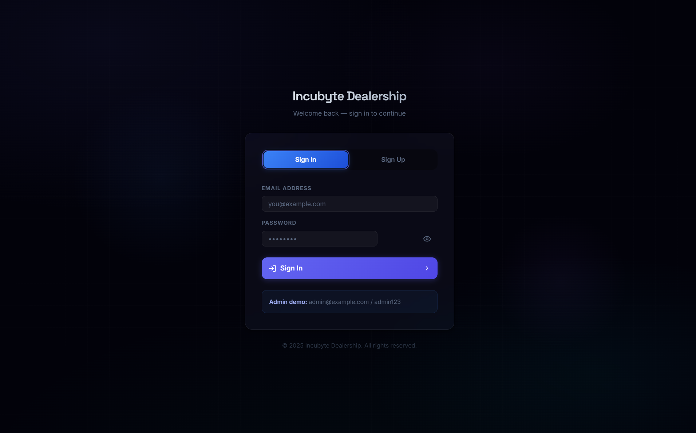
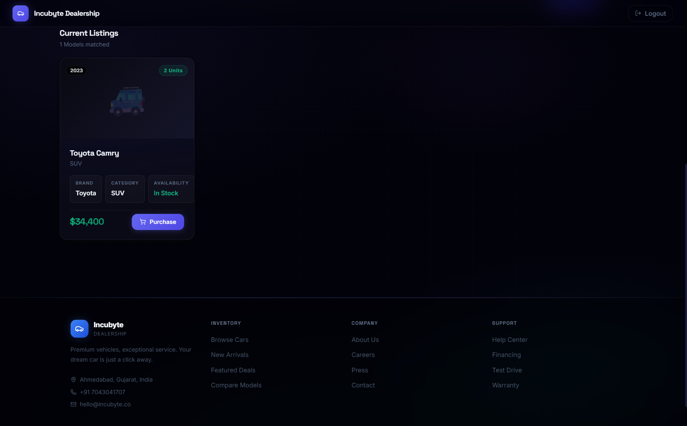
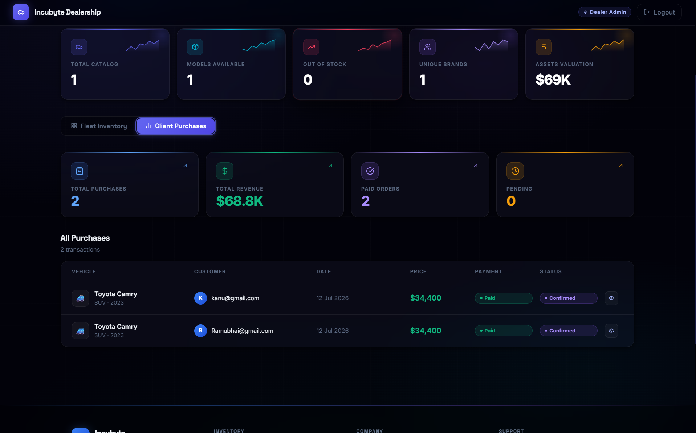
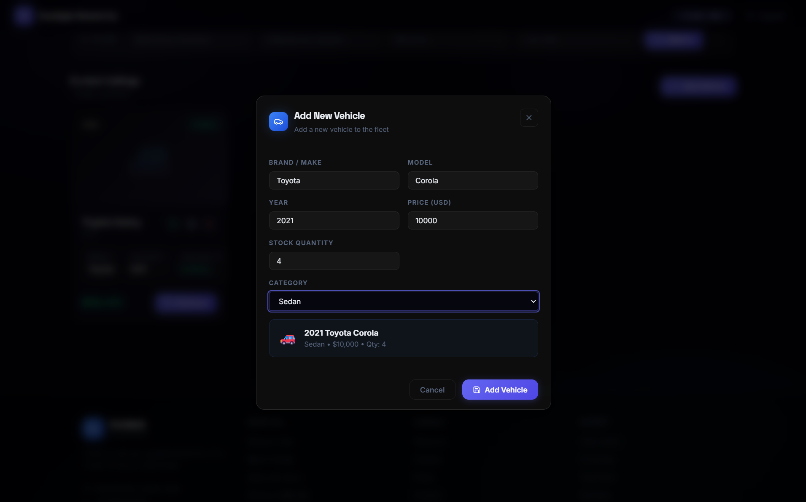
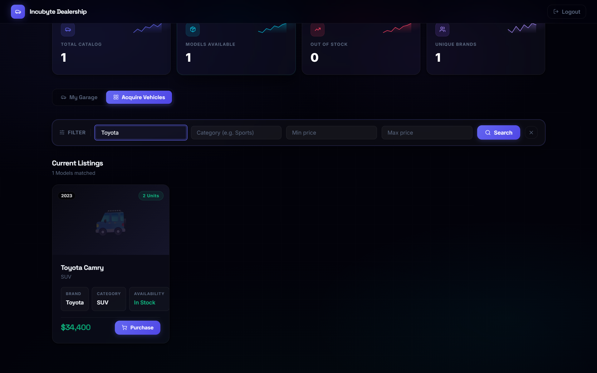

# Car Dealership Inventory System

A full-stack Car Dealership Inventory System built as part of the Incubyte Full Stack Assessment. The application provides inventory management, user authentication, role-based authorization, vehicle purchasing, and inventory restocking through a RESTful API and a modern React frontend.

## Live Demo

Frontend: https://incubyte-car-dealership-inventory-s.vercel.app/

Backend: https://incubyte-car-dealership-inventory-system.onrender.com

## Features

### Authentication

- User registration
- User login with JWT authentication
- BCrypt password hashing
- Role-based authorization (Admin/User)

### Vehicle Management

- View all vehicles
- Search vehicles by make, category, and price range
- Add new vehicles (Admin)
- Update vehicle details (Admin)
- Delete vehicles (Admin)
- Purchase vehicles
- Restock inventory (Admin)

### Technical Features

- RESTful API
- JWT Authentication
- PostgreSQL Database
- Docker support
- CI using GitHub Actions
- Swagger API documentation
- Production deployment using Render and Vercel

---

# Technology Stack

## Backend

- Java 21
- Spring Boot 3
- Spring Security
- Spring Data JPA
- PostgreSQL
- JWT
- Maven
- Docker

## Frontend

- React
- Vite
- JavaScript
- CSS

## DevOps

- Docker
- Docker Compose
- GitHub Actions
- Render
- Vercel

---

# Project Structure

```
.
├── backend
│   ├── src
│   ├── Dockerfile
│   ├── pom.xml
│   └── mvnw
│
├── frontend
│   ├── src
│   ├── Dockerfile
│   ├── package.json
│   └── vercel.json
│
├── docker-compose.yml
├── render.yaml
├── postman_collection.json
└── README.md
```

---

# Backend Setup

## Prerequisites

- Java 21
- Maven
- PostgreSQL

## Clone Repository

```bash
git clone https://github.com/DeepVaishnav17/Incubyte-Car-dealership-inventory-system.git

cd Incubyte-Car-dealership-inventory-system
```

## Configure Environment Variables

Create a `.env` file or configure the following variables:

```env
DB_URL=jdbc:postgresql://localhost:5432/dealership
DB_USER=postgres
DB_PASSWORD=postgres

JWT_SECRET=your_secret_key
JWT_EXPIRATION=86400000
```

## Run Backend

```bash
cd backend

./mvnw spring-boot:run
```

or

```bash
mvn spring-boot:run
```

Backend runs at

```
http://localhost:8080
```

---

# Frontend Setup

## Install Dependencies

```bash
cd frontend

npm install
```

## Configure Environment Variable

Create a `.env` file.

```env
VITE_API_URL=http://localhost:8080/api
```

## Run Frontend

```bash
npm run dev
```

Frontend runs at

```
http://localhost:5173
```

---

# Running with Docker

From the project root:

```bash
docker compose up --build
```

# Screenshots

## Registration



## Vehicle Dashboard



## Admin Dashboard



## Add Vehicle



## Search Vehicles



---

# Running Tests

## Backend

```bash
cd backend

mvn test
```

## Frontend

```bash
cd frontend

npm test
```

---

# Test Report
## Frontend Test Summary

| Metric | Result |
|---------|--------|
| Test Files | 2 Passed |
| Tests Run | 7 |
| Passed | 7 |
| Failed | 0 |
| Skipped | 0 |
| Duration | 5.69s |

GitHub Actions executes the backend and frontend test suites automatically on every push to the main branch.

---

# Deployment

Frontend

https://incubyte-car-dealership-inventory-s.vercel.app/

Backend

https://incubyte-car-dealership-inventory-system.onrender.com


---

# My AI Usage

AI tools were used throughout the development process as productivity assistants. The usage included:

- Generating initial project scaffolding.
- Assisting with Docker configuration.
- Debugging deployment issues on Render and Vercel.
- Improving GitHub Actions workflow configuration.
- Explaining Spring Security and JWT authentication issues.
- Refining API integration and frontend debugging.
- Improving documentation and README formatting.

All architecture decisions, implementation verification, debugging, testing, and final code integration were manually reviewed and validated before submission.

---

# Author

Deep Vaishnav

GitHub

https://github.com/DeepVaishnav17
